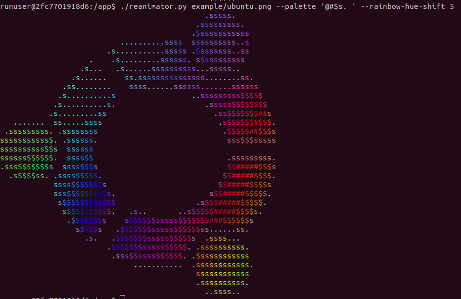
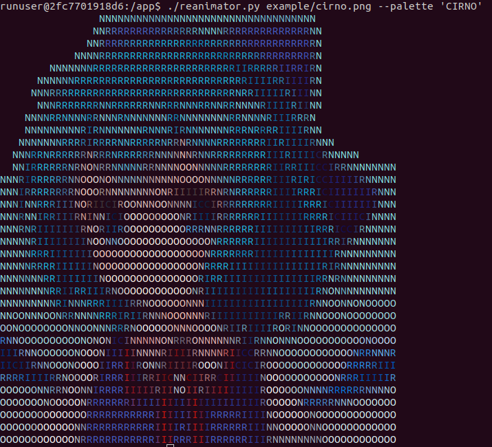

<pre style="font: monospace; background-color: black; color: white;">                                                                                                                      
 <span style="color: rgb(216,49,131);">-</span><span style="color: rgb(129,37,77);">:</span><span style="color: rgb(249,61,143);">=</span><span style="color: rgb(255,88,212);">s</span><span style="color: rgb(255,93,218);">$</span><span style="color: rgb(255,92,208);">s</span><span style="color: rgb(255,78,168);">s</span><span style="color: rgb(173,48,85);">;</span>                         <span style="color: rgb(93,65,26);">,</span><span style="color: rgb(220,158,55);">=</span>                 <span style="color: rgb(57,69,20);">,</span><span style="color: rgb(255,232,123);">$</span><span style="color: rgb(227,255,74);">s</span>                                              <span style="color: rgb(39,169,147);">-</span><span style="color: rgb(107,255,176);">s</span><span style="color: rgb(120,255,187);">$</span><span style="color: rgb(118,255,191);">$</span><span style="color: rgb(91,255,203);">s</span><span style="color: rgb(13,46,49);">.</span>          
 <span style="color: rgb(255,140,243);">#</span><span style="color: rgb(255,119,236);">$</span>  <span style="color: rgb(55,11,24);">.</span><span style="color: rgb(50,10,29);">.</span><span style="color: rgb(105,23,47);">,</span><span style="color: rgb(255,62,108);">=</span><span style="color: rgb(255,137,211);">$</span><span style="color: rgb(255,145,210);">$</span><span style="color: rgb(111,24,26);">,</span>                    <span style="color: rgb(162,104,39);">;</span><span style="color: rgb(255,150,129);">s</span><span style="color: rgb(255,132,102);">s</span><span style="color: rgb(255,171,146);">$</span>                  <span style="color: rgb(174,212,57);">=</span><span style="color: rgb(69,100,24);">,</span>                                     <span style="color: rgb(99,255,125);">=</span><span style="color: rgb(121,255,147);">s</span>     <span style="color: rgb(31,141,128);">;</span><span style="color: rgb(163,255,202);">$</span><span style="color: rgb(86,255,171);">s</span>   <span style="color: rgb(8,43,36);">.</span><span style="color: rgb(134,255,210);">$</span><span style="color: rgb(141,255,217);">$</span>         
 <span style="color: rgb(255,86,218);">s</span><span style="color: rgb(255,83,198);">s</span>       <span style="color: rgb(255,71,116);">=</span><span style="color: rgb(255,141,201);">$</span>     <span style="color: rgb(90,31,23);">,</span><span style="color: rgb(255,87,127);">=</span><span style="color: rgb(255,113,151);">s</span><span style="color: rgb(255,110,143);">s</span><span style="color: rgb(255,95,67);">-</span>         <span style="color: rgb(255,135,116);">s</span><span style="color: rgb(255,155,136);">s</span> <span style="color: rgb(149,115,26);">;</span><span style="color: rgb(255,143,103);">s</span>     <span style="color: rgb(174,149,52);">-</span>  <span style="color: rgb(255,234,70);">s</span><span style="color: rgb(255,197,111);">$</span><span style="color: rgb(255,201,108);">$</span><span style="color: rgb(255,246,77);">$</span>           <span style="color: rgb(105,182,42);">;</span><span style="color: rgb(23,49,13);">.</span> <span style="color: rgb(114,207,51);">-</span><span style="color: rgb(223,255,97);">$</span><span style="color: rgb(222,255,113);">$</span><span style="color: rgb(201,255,92);">s</span><span style="color: rgb(55,121,28);">,</span>   <span style="color: rgb(152,255,83);">s</span><span style="color: rgb(187,255,111);">s</span><span style="color: rgb(182,255,109);">s</span><span style="color: rgb(96,255,70);">=</span>       <span style="color: rgb(15,47,21);">.</span><span style="color: rgb(74,255,85);">-</span><span style="color: rgb(133,255,114);">s</span><span style="color: rgb(129,255,114);">s</span><span style="color: rgb(109,255,99);">=</span><span style="color: rgb(32,128,66);">:</span>    <span style="color: rgb(104,255,124);">=</span><span style="color: rgb(19,77,50);">,</span><span style="color: rgb(84,255,124);">=</span><span style="color: rgb(94,255,131);">=</span><span style="color: rgb(27,99,81);">,</span><span style="color: rgb(95,255,142);">s</span><span style="color: rgb(32,138,119);">;</span>  <span style="color: rgb(135,255,186);">$</span><span style="color: rgb(67,255,228);">s</span>      <span style="color: rgb(119,255,214);">$</span><span style="color: rgb(91,255,220);">$</span>   <span style="color: rgb(43,124,167);">;</span><span style="color: rgb(9,35,57);">.</span> <span style="color: rgb(53,157,215);">=</span><span style="color: rgb(107,255,255);">$</span>
 <span style="color: rgb(255,89,223);">$</span><span style="color: rgb(255,77,170);">s</span>       <span style="color: rgb(255,134,198);">$</span><span style="color: rgb(255,112,183);">s</span>   <span style="color: rgb(127,43,27);">,</span><span style="color: rgb(255,145,181);">$</span><span style="color: rgb(255,73,76);">-</span>    <span style="color: rgb(255,129,145);">s</span><span style="color: rgb(255,113,128);">s</span>      <span style="color: rgb(255,175,163);">$</span><span style="color: rgb(255,122,87);">=</span>  <span style="color: rgb(255,157,79);">s</span><span style="color: rgb(255,153,110);">s</span>    <span style="color: rgb(35,43,0);">.</span><span style="color: rgb(255,205,156);">$</span><span style="color: rgb(255,191,118);">$</span><span style="color: rgb(255,237,71);">$</span><span style="color: rgb(111,117,34);">:</span>  <span style="color: rgb(89,105,28);">:</span><span style="color: rgb(255,226,149);">#</span><span style="color: rgb(255,222,115);">$</span>    <span style="color: rgb(255,249,177);">#</span><span style="color: rgb(245,255,88);">$</span>   <span style="color: rgb(243,255,137);">#</span><span style="color: rgb(238,255,132);">$</span><span style="color: rgb(167,255,74);">s</span><span style="color: rgb(62,114,28);">,</span>   <span style="color: rgb(210,255,122);">$</span><span style="color: rgb(205,255,119);">$</span><span style="color: rgb(196,255,110);">$</span><span style="color: rgb(146,255,81);">=</span><span style="color: rgb(17,56,12);">.</span>  <span style="color: rgb(30,131,34);">,</span><span style="color: rgb(193,255,153);">$</span><span style="color: rgb(163,255,110);">s</span>   <span style="color: rgb(50,209,83);">;</span><span style="color: rgb(207,255,196);">#</span><span style="color: rgb(157,255,138);">s</span>    <span style="color: rgb(65,255,143);">=</span><span style="color: rgb(147,255,150);">s</span><span style="color: rgb(26,106,74);">,</span>  <span style="color: rgb(32,138,99);">:</span> <span style="color: rgb(63,255,186);">s</span><span style="color: rgb(79,255,176);">s</span> <span style="color: rgb(20,71,58);">,</span>   <span style="color: rgb(119,255,182);">s</span><span style="color: rgb(32,129,140);">;</span>      <span style="color: rgb(95,255,214);">$</span><span style="color: rgb(103,255,219);">$</span>   <span style="color: rgb(136,255,243);">#</span><span style="color: rgb(126,255,246);">$</span><span style="color: rgb(88,251,255);">$</span><span style="color: rgb(46,133,196);">-</span><span style="color: rgb(16,37,59);">.</span>
 <span style="color: rgb(255,89,207);">s</span><span style="color: rgb(255,79,162);">s</span><span style="color: rgb(253,57,118);">=</span><span style="color: rgb(255,129,217);">$</span><span style="color: rgb(255,141,216);">$</span><span style="color: rgb(255,124,206);">$</span><span style="color: rgb(255,108,196);">s</span><span style="color: rgb(255,111,192);">s</span><span style="color: rgb(255,65,97);">-</span>     <span style="color: rgb(255,126,169);">s</span><span style="color: rgb(123,48,25);">,</span>      <span style="color: rgb(255,151,157);">$</span><span style="color: rgb(255,97,103);">=</span>   <span style="color: rgb(153,99,37);">;</span><span style="color: rgb(255,139,122);">s</span>    <span style="color: rgb(255,177,73);">s</span><span style="color: rgb(255,154,95);">s</span>     <span style="color: rgb(255,185,105);">s</span><span style="color: rgb(71,85,12);">,</span>     <span style="color: rgb(146,190,41);">-</span><span style="color: rgb(255,229,126);">$</span>    <span style="color: rgb(255,250,113);">$</span><span style="color: rgb(111,203,41);">-</span>   <span style="color: rgb(214,255,89);">s</span><span style="color: rgb(173,255,71);">s</span>      <span style="color: rgb(192,255,98);">s</span><span style="color: rgb(25,127,19);">,</span>     <span style="color: rgb(40,203,64);">;</span><span style="color: rgb(169,255,126);">s</span>           <span style="color: rgb(88,255,104);">=</span><span style="color: rgb(78,255,129);">=</span>    <span style="color: rgb(75,255,168);">s</span><span style="color: rgb(97,255,145);">s</span>     <span style="color: rgb(116,255,186);">s</span><span style="color: rgb(38,149,166);">-</span>      <span style="color: rgb(98,255,218);">$</span><span style="color: rgb(98,255,223);">$</span>   <span style="color: rgb(79,236,255);">$</span><span style="color: rgb(83,220,255);">s</span>   
 <span style="color: rgb(255,89,211);">s</span><span style="color: rgb(255,70,146);">=</span>    <span style="color: rgb(72,12,14);">.</span><span style="color: rgb(255,120,192);">$</span>     <span style="color: rgb(194,68,41);">;</span><span style="color: rgb(255,98,145);">s</span><span style="color: rgb(128,61,24);">:</span><span style="color: rgb(189,78,50);">;</span><span style="color: rgb(255,113,141);">s</span><span style="color: rgb(255,118,140);">s</span><span style="color: rgb(255,118,136);">s</span><span style="color: rgb(255,105,119);">=</span><span style="color: rgb(255,142,65);">=</span><span style="color: rgb(204,109,48);">-</span><span style="color: rgb(239,137,50);">=</span>  <span style="color: rgb(255,159,149);">$</span><span style="color: rgb(255,172,160);">$</span><span style="color: rgb(64,56,12);">.</span> <span style="color: rgb(85,68,24);">,</span><span style="color: rgb(139,106,36);">:</span> <span style="color: rgb(255,196,61);">s</span><span style="color: rgb(255,195,78);">s</span> <span style="color: rgb(178,145,45);">-</span><span style="color: rgb(54,53,12);">.</span>  <span style="color: rgb(255,194,115);">$</span><span style="color: rgb(150,171,38);">-</span>     <span style="color: rgb(195,248,58);">s</span><span style="color: rgb(255,231,112);">$</span>    <span style="color: rgb(254,255,116);">$</span><span style="color: rgb(114,207,45);">-</span>   <span style="color: rgb(222,255,93);">$</span><span style="color: rgb(223,255,96);">$</span>      <span style="color: rgb(193,255,113);">$</span><span style="color: rgb(30,148,34);">:</span>     <span style="color: rgb(63,255,81);">-</span><span style="color: rgb(153,255,110);">s</span>    <span style="color: rgb(114,255,96);">=</span><span style="color: rgb(139,255,127);">s</span><span style="color: rgb(103,255,93);">=</span><span style="color: rgb(71,255,128);">=</span><span style="color: rgb(56,237,126);">-</span><span style="color: rgb(27,96,56);">,</span> <span style="color: rgb(88,255,122);">=</span><span style="color: rgb(63,255,173);">s</span>    <span style="color: rgb(87,255,151);">s</span><span style="color: rgb(109,255,157);">s</span>     <span style="color: rgb(123,255,193);">$</span><span style="color: rgb(35,138,150);">;</span>      <span style="color: rgb(91,255,222);">$</span><span style="color: rgb(98,255,229);">$</span>   <span style="color: rgb(82,243,255);">$</span><span style="color: rgb(103,255,255);">$</span>   
 <span style="color: rgb(255,89,203);">s</span><span style="color: rgb(255,92,197);">s</span>      <span style="color: rgb(255,144,195);">$</span><span style="color: rgb(255,103,168);">s</span>    <span style="color: rgb(255,135,166);">s</span><span style="color: rgb(152,64,38);">:</span>         <span style="color: rgb(67,39,18);">.</span><span style="color: rgb(153,100,39);">;</span> <span style="color: rgb(110,85,25);">:</span><span style="color: rgb(224,161,59);">=</span><span style="color: rgb(255,191,66);">s</span><span style="color: rgb(238,184,63);">=</span> <span style="color: rgb(255,200,70);">s</span><span style="color: rgb(255,203,78);">s</span> <span style="color: rgb(255,214,72);">s</span><span style="color: rgb(99,95,29);">:</span>  <span style="color: rgb(255,199,114);">$</span><span style="color: rgb(160,183,37);">-</span>     <span style="color: rgb(188,255,57);">s</span><span style="color: rgb(255,235,112);">$</span>    <span style="color: rgb(250,255,115);">$</span><span style="color: rgb(105,206,44);">-</span>   <span style="color: rgb(214,255,92);">$</span><span style="color: rgb(217,255,95);">$</span>      <span style="color: rgb(189,255,114);">s</span><span style="color: rgb(31,165,35);">:</span>     <span style="color: rgb(62,255,88);">-</span><span style="color: rgb(148,255,110);">s</span>   <span style="color: rgb(146,255,130);">s</span><span style="color: rgb(145,255,133);">s</span>      <span style="color: rgb(76,255,133);">=</span><span style="color: rgb(59,244,176);">=</span>    <span style="color: rgb(105,255,154);">s</span><span style="color: rgb(96,255,158);">s</span>     <span style="color: rgb(121,255,196);">$</span><span style="color: rgb(108,255,196);">s</span>      <span style="color: rgb(149,255,237);">#</span><span style="color: rgb(59,179,242);">=</span>   <span style="color: rgb(81,237,255);">$</span><span style="color: rgb(103,249,255);">$</span>   
 <span style="color: rgb(255,151,223);">$</span><span style="color: rgb(255,169,226);">#</span>       <span style="color: rgb(255,154,194);">$</span><span style="color: rgb(255,176,204);">#</span><span style="color: rgb(127,53,35);">:</span>   <span style="color: rgb(255,116,144);">s</span><span style="color: rgb(255,159,174);">$</span><span style="color: rgb(255,107,126);">=</span><span style="color: rgb(255,115,73);">=</span><span style="color: rgb(255,135,66);">=</span><span style="color: rgb(255,92,97);">=</span><span style="color: rgb(255,161,161);">$</span><span style="color: rgb(255,188,186);">$</span><span style="color: rgb(119,84,34);">:</span>         <span style="color: rgb(255,177,125);">s</span><span style="color: rgb(255,197,153);">$</span>    <span style="color: rgb(66,83,15);">,</span><span style="color: rgb(255,230,187);">#</span><span style="color: rgb(255,202,97);">s</span>     <span style="color: rgb(255,236,120);">$</span><span style="color: rgb(255,247,183);">#</span>    <span style="color: rgb(250,255,188);">#</span><span style="color: rgb(239,255,96);">$</span>   <span style="color: rgb(230,255,150);">#</span><span style="color: rgb(230,255,164);">#</span>     <span style="color: rgb(22,118,22);">,</span><span style="color: rgb(221,255,188);">#</span><span style="color: rgb(154,255,91);">s</span>     <span style="color: rgb(153,255,116);">s</span><span style="color: rgb(199,255,182);">#</span>   <span style="color: rgb(14,54,38);">.</span><span style="color: rgb(138,255,130);">s</span><span style="color: rgb(135,255,131);">s</span><span style="color: rgb(83,255,103);">=</span><span style="color: rgb(78,255,127);">=</span><span style="color: rgb(99,255,110);">=</span><span style="color: rgb(132,255,144);">s</span><span style="color: rgb(107,255,126);">=</span><span style="color: rgb(139,255,158);">s</span><span style="color: rgb(137,255,160);">s</span>    <span style="color: rgb(72,255,182);">s</span><span style="color: rgb(161,255,198);">$</span><span style="color: rgb(79,255,196);">s</span><span style="color: rgb(87,255,184);">s</span><span style="color: rgb(37,164,157);">-</span>   <span style="color: rgb(114,255,203);">$</span><span style="color: rgb(160,255,223);">#</span><span style="color: rgb(96,255,207);">s</span><span style="color: rgb(65,227,253);">s</span><span style="color: rgb(72,233,255);">s</span><span style="color: rgb(110,255,226);">$</span><span style="color: rgb(159,255,239);">#</span><span style="color: rgb(68,221,255);">s</span>    <span style="color: rgb(149,251,255);">#</span><span style="color: rgb(172,249,255);">#</span>   
                   <span style="color: rgb(117,53,28);">,</span><span style="color: rgb(128,62,31);">:</span><span style="color: rgb(39,26,11);">.</span>                                                            <span style="color: rgb(16,45,25);">.</span><span style="color: rgb(24,113,66);">,</span>            <span style="color: rgb(38,148,124);">;</span>       <span style="color: rgb(28,109,127);">:</span><span style="color: rgb(27,89,103);">:</span>            
</pre>

# ReAnimator ASCII Art Generator
A python script to generate ascii art from text or images.

## Usage:
```
usage: reanimator.py [--greyscale] [--width WIDTH] [--palette PALETTE] [--palette-block] [--palette-ascii] [--keep-background] [--kernelize-image] [--gradient] [--gradient-strength GRADIENT_STRENGTH]
                     [--hue-shift HUE_SHIFT] [--rainbow-hue-shift RAINBOW_HUE_SHIFT] [--median-blur MEDIAN_BLUR] [--text TEXT] [--text-font TEXT_FONT] [--text-size TEXT_SIZE] [--text-color TEXT_COLOR]
                     [--html-output] [--help]
                     [image ...]

Convert text or images to ASCII art. Specify an image path or a a --text argument to generate ascii art.

positional arguments:
  image                 List of images to convert

options:
  --greyscale           Render the image in greyscale
  --width WIDTH         Width of the ASCII art in characters, default is 64
  --palette PALETTE     ASCII palette to use for rendering
  --palette-block       Use the block ASCII palette '░▒▓█'
  --palette-ascii       Use the extended ASCII palette '.-;=s$#@'
  --keep-background     Keep the background in the ASCII art
  --kernelize-image     Apply edge detection and attempt to draw the edges with lines
  --gradient            Apply edge detection to the image
  --gradient-strength GRADIENT_STRENGTH
                        Control the strength of the gradient in edge detection
  --hue-shift HUE_SHIFT
                        Hue-shifts the image before transforming it
  --rainbow-hue-shift RAINBOW_HUE_SHIFT
                        Hue-shifts the image in rainbow pattern at the speed controlled by this argument
  --median-blur MEDIAN_BLUR
                        Median blurs the image with the given kernel size
  --text TEXT           Generates an image of the text and then converts it to ascii art
  --text-font TEXT_FONT
                        The font used in text to image generation, defaults to roboto
  --text-size TEXT_SIZE
                        The font size used in text to image generation, defaults to 80
  --text-color TEXT_COLOR
                        Color of the text to image, must be a hex color code like '#ff03a1'
  --html-output         Outputs the image as an html block rather than terminal text
  --help                Show help message and exit.
```

Simple example:
```sh
python reanimator.py example/ubuntu.png
```
Text conversion:
```sh
python reanimator.py --text "hello world!" --width 128
```

## Examples:





